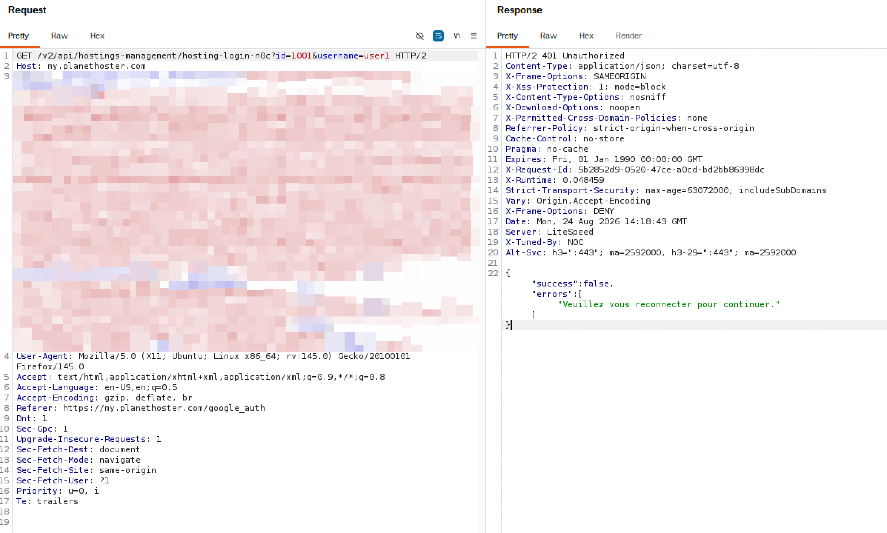

# Moonhacker

My cyber Security profile
# Hi, I am Moon Hacker 👋
### Cyber Security Learner | Ethical Hacker | Bug Bounty Hunter (In Progress)

> My goal is to become a professional Bug Bounty Hunter and help companies secure their systems.

---

### 🚀 About Me
- 🔭 Currently learning: Web Application Penetration Testing
- 🌱 I’m working on: Scanning & finding vulnerabilities on test labs like testphp.vulnweb.com
- 🎯 My 2026 Goal: Find my first real bug and get my first internship

### 🛠️ Skills & Tools
- **OS:** Kali Linux, Windows
- **Networking:** Ping, Curl, DNS Lookup
- **Scanning Tools:** Nmap, Nikto
- **Learning:** Burp Suite, OWASP Top 10

### 📚 My First Scan Project
**Target:** testphp.vulnweb.com (Vulnerable Lab)
- Found outdated PHP version 5.6 using  curl -I
- Found missing security headers (X-Frame-Options) using nikto

### 📫 Connect With Me
- LinkedIn: https://www.linkedin.com/in/muntazir-mehdi-8a799a3aa
- Email: ma644852king@gmail.com

⭐️ From Moonhacker - Securing the web, one scan at a time!
